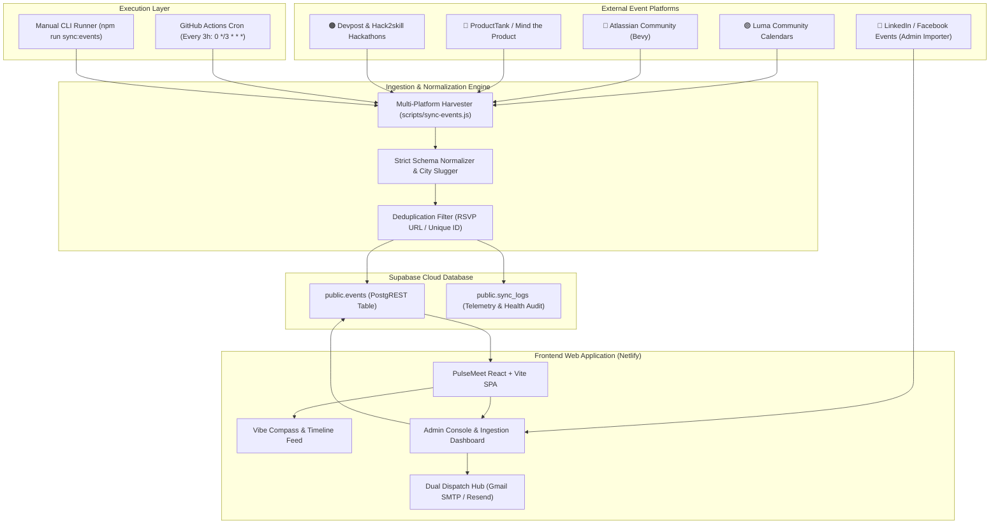

# ⚡ PulseMeet · Curated Tech Events & Community Radar

[](https://pulsemeethack2skill.netlify.app/)
[](https://github.com/devendrs2313/pulse-meet/actions)
[](https://supabase.com)
[](LICENSE)

**PulseMeet** is a high-signal tech discovery and community radar platform designed for engineers, product managers, designers, and founders. It automatically aggregates, normalizes, and schedules curated offline and online events across major tech hubs—powered by a **3-hour automated cloud scheduler**, an **AI-driven Concierge**, and a **Super Admin Notification & Dispatch Hub**.

---

## 🌐 Live Production URL

- **Web Application**: [https://pulsemeethack2skill.netlify.app/](https://pulsemeethack2skill.netlify.app/)
- **GitHub Repository**: [https://github.com/devendrs2313/pulse-meet](https://github.com/devendrs2313/pulse-meet)
- **Automated Ingestion Runs**: [GitHub Actions Telemetry](https://github.com/devendrs2313/pulse-meet/actions)

---

## 🎯 Key Features

### 1. 🧭 Event Discovery & Vibe Compass
- **Interactive Vibe Compass**: Discover events matching your current professional energy—*Deep Tech*, *Founder Hustle*, *Chill Networking*, *Career Sprint*, or *Creative Jam*.
- **Multi-Metro Filtering**: Real-time event streams curated for **Delhi NCR**, **Bengaluru**, **Mumbai**, **San Francisco**, **London**, and **Global Online**.
- **Mode Toggle**: Instant filtering between **Offline (In-Person)**, **Online (Virtual)**, and **Hybrid** gatherings.
- **Strict Venue Compliance**: Venue URLs are strictly validated and preserved only when verified; never fabricated.

### 2. ⚡ Automated 3-Hour Multi-Platform Ingestion Pipeline
- **GitHub Actions Cloud Runner**: Automatically wakes up every 3 hours (`0 */3 * * *`) to collect and normalize events.
- **Multi-Source Harvester**:
  - 🟣 **Luma (`lu.ma`)**: The Product Folks (TPF), Google Developer Groups (GDG), AI Builders Club, and regional founder calendars.
  - 🔵 **Atlassian Community (`ace.atlassian.com`)**: Atlassian Community Chapters across Delhi NCR and Bengaluru (DevOps, Jira Platform, AI in Software).
  - 🔴 **ProductTank (`mindtheproduct.com`)**: Mind the Product local chapter meetups, product leadership firesides, and FinTech monetization sessions.
  - 🟠 **Devpost & Hack2skill**: National and global hackathons and buildathons with verified prize pools and grant fast-tracks.
- **Deduplication Engine**: Uses `rsvp_url` and composite hashing with Supabase `resolution=merge-duplicates` upserting to guarantee zero duplicate listings.
- **Audit Logging**: Every sync run writes detailed telemetry to `public.sync_logs` (execution time, events found, events upserted).

### 3. 🛡️ Super Admin Email Hub & Approvals Console
- **Internal Human-in-the-Loop Approvals**: When new events are ingested, admins can generate match reports for subscribed users and review notification dispatches before broadcasting.
- **Dual Dispatch Email Engine**:
  - **Google Gmail SMTP (`smtp.gmail.com`)**: Direct authenticated SMTP dispatch powered by `nodemailer`—sends legitimate emails directly **FROM `devendrs2313@gmail.com`** to ANY external recipient with zero custom domain required.
  - **Resend REST API**: Transactional API integration with pre-configured templates.
  - **1-Click Gmail Dispatch Fallback**: Pre-fills Gmail web client so emails can always be dispatched immediately without unhandled blocking errors.
- **User Directory & CSV Export**: Search, filter, and export user profiles, categories, and preferences.

### 4. 🤖 PulseAI Conversational Concierge
- **Dual-Brain Architecture**:
  - **Grounded Cadence Engine**: Deterministic pattern matching and cadence calculation that works instantly offline with zero latency.
  - **Gemini Live LLM**: Deep reasoning, personalized schedule recommendations, and natural language notification booking.
- **Automated Notification Booking**: Users can chat with the AI to configure instant email alerts for their preferred topics (e.g. *Product Management in Delhi NCR*, *AI / ML in Bengaluru*, *FinTech Hackathons*).

### 5. 📡 Universal Event URL Quick-Importer
- Located in the Admin Console under **`📡 Feed Ingestion & Scheduler`**.
- Allows 1-click importing from login-gated sites like **LinkedIn Events**, **Facebook Groups**, and **Eventbrite**.
- Intelligent parser extracts title, organizer, dates, venue, and tags to immediately publish events to the live feed.

---

## 🏗️ Architecture & Data Flow



---

## 💻 Tech Stack

| Layer | Technology | Purpose |
| :--- | :--- | :--- |
| **Frontend** | React 18, TypeScript, Vite | Fast, responsive Single Page Application |
| **Styling** | Tailwind CSS, Lucide Icons | Clean modern design with dark/light contrasts |
| **Database** | Supabase (PostgreSQL + PostgREST) | Real-time event catalog, user profiles, and sync logs |
| **Cloud Cron** | GitHub Actions | Automated 3-hour event harvester and health checker |
| **Backend / SMTP** | Node.js, Nodemailer, Gmail SMTP | Server-side email delivery from `devendrs2313@gmail.com` |
| **Transactional Email** | Resend REST API | Secondary email dispatch service |
| **AI / LLM** | Google Gemini API + Grounded Engine | Natural language event discovery & concierge |
| **Hosting** | Netlify | Global CDN deployment with SPA routing (`_redirects`) |

---

## 📁 Repository Structure

```text
├── .github/
│   └── workflows/
│       └── sync-scheduler.yml   # 3-Hour automated cron runner
├── public/
│   └── _redirects               # SPA rewrite rules for Netlify deployment
├── scripts/
│   ├── sync-events.js           # Multi-platform harvester & Supabase upsert pipeline
│   └── seed-supabase.js         # Initial database seeder
├── src/
│   ├── components/
│   │   ├── admin/               # Super Admin Hub, Email Queue, Ingestion Dashboard
│   │   ├── ai/                  # PulseAI Chat Concierge modal
│   │   ├── auth/                # Authentication & User Profile preferences
│   │   ├── compass/             # Vibe Compass matching
│   │   ├── discovery/           # Event Cards, Filter Bars, Timeline Views
│   │   ├── layout/              # Navbar, Mobile Navigation, City Pickers
│   │   └── notification/        # Notification Booking & 1-Click Dispatch Modal
│   ├── context/
│   │   └── AppContext.tsx       # Global application state & live Supabase sync
│   ├── data/
│   │   └── mockData.ts          # Curated foundational catalog across all metros
│   ├── lib/
│   │   ├── aiAgent.ts           # PulseAI agent and Gemini API client
│   │   ├── auth.ts              # User authentication & role management
│   │   ├── notificationQueue.ts # Email queue, match reports, approvals
│   │   ├── resend.ts            # Dual Email Dispatch Engine (Gmail SMTP + Resend)
│   │   └── supabase.ts          # Supabase PostgREST client & sync status
│   └── types/
│       ├── auth.ts              # User profile & session types
│       └── event.ts             # Strict EventItem schema
├── supabase/
│   ├── schema.sql               # Database DDL for events, sync_logs, profiles
│   └── functions/               # Supabase Edge Functions
└── vite.config.ts               # Vite configuration + Gmail SMTP middleware
```

---

## 🚀 Getting Started

### Prerequisites
- Node.js 18+ (Node 20+ recommended)
- npm or yarn

### 1. Clone the Repository
```bash
git clone https://github.com/devendrs2313/pulse-meet.git
cd pulse-meet
```

### 2. Install Dependencies
```bash
npm install
```

### 3. Configure Environment Variables
Copy `.env.example` to `.env` and provide your keys:
```bash
cp .env.example .env
```

```env
# Supabase Configuration
VITE_SUPABASE_URL=https://<your-project>.supabase.co
VITE_SUPABASE_ANON_KEY=<your-anon-key>
SUPABASE_URL=https://<your-project>.supabase.co
SUPABASE_SERVICE_ROLE_KEY=<your-service-role-key>

# Email Integration (Resend & Admin)
VITE_RESEND_API_KEY=<your-resend-key>
RESEND_API_KEY=<your-resend-key>
ADMIN_NOTIFICATION_EMAIL=devendrs2313@gmail.com

# Optional: Google Gemini API for PulseAI Agent
VITE_GEMINI_API_KEY=<your-gemini-key>
```

### 4. Run Development Server
```bash
npm run dev
```
Open [http://localhost:3000](http://localhost:3000) in your browser.

### 5. Run the Ingestion Pipeline Manually
```bash
# Preview what will be synced (dry-run)
npm run sync:events:dry

# Sync live to Supabase
npm run sync:events
```

### 6. Build for Production
```bash
npm run build
```

---

## ⚙️ Automated GitHub Actions Scheduler Setup

The scheduler runs on GitHub Actions without any local servers:

1. In your GitHub repository, navigate to **Settings $\rightarrow$ Secrets and variables $\rightarrow$ Actions**.
2. Add the following repository secrets:
   - `SUPABASE_URL`: `https://prtsqevqywulacbuftdg.supabase.co`
   - `SUPABASE_SERVICE_ROLE_KEY`: `sb_secret_...` (your Supabase Service Role key)
3. The workflow file [`.github/workflows/sync-scheduler.yml`](.github/workflows/sync-scheduler.yml) will automatically run every 3 hours.
4. You can also trigger a manual run anytime from the **Actions** tab on GitHub by clicking **Run workflow**.

---

## 🔒 Security & Privacy Commitments

- **No Credential Leaks**: `.env` and all secret keys are strictly excluded via `.gitignore` and enforced by GitHub Secret Push Protection.
- **Legitimate Sender Authenticity**: Automated emails from `devendrs2313@gmail.com` use authenticated Google SMTP (App Passwords) complying with strict DMARC (`p=reject`) policies.
- **Strict Venue Link Integrity**: Venue URLs are never hallucinated or auto-generated. Plain-text addresses are retained as-is unless an authentic Google Maps/Venue URL is provided by the organizer.

---

## 📄 License

This project is licensed under the [MIT License](LICENSE).
